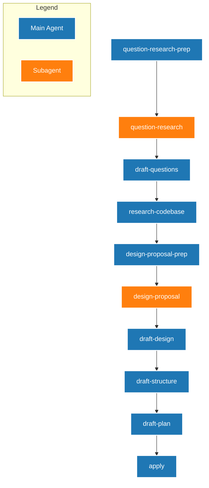

# QRSPI Workflow Schema

The `qrspi` schema is an implementation of the ACE-FCA (Advanced Context Engineering for Coding Agents) "QRSPI" process, first presented by HumanLayer's Dex in the *"Everything We Got Wrong About RPI"* talk.

The core philosophy of QRSPI is avoiding large monolithic prompts that exhaust an LLM's "instruction budget", and instead prioritizing smaller checkpoints that humans can review without suffering from code-blindness.

## The Phases (Questions, Research, Design, Structure, Plan, Implement)

This schema is a sequential string of artifacts representing the QRSPI lifecycle natively running within OpenSpec's Directed Acyclic Graph (DAG) state machine.



To enable **Frequent Intentional Compaction (FIC)**, this schema isolates every single phase using a mix of explicitly routed Subagents and autonomous **Context Drops** (restarting the entire AI task session). This completely eliminates instruction budget exhaustion and stops feature hallucination dead in its tracks.

## How Handoffs & Context Drops Work

To ensure speed and efficiency, the DAG relies on two distinct mechanisms to clear its memory:

1. **Subagent Handoffs (`*-prep` nodes)**: For phases where the agent must perform "Blind" code mapping without ticket bias, the Main Agent dynamically generates a strict `.instructions/<artifact>.md` payload. An isolated Subagent is spawned to execute the instructions blindly.
2. **Autonomous Context Drops**: For linearly executed document drafting, the Main Agent generates the file directly, then performs a Context Drop to wipe its conversational memory before moving to the next node. If your agent framework supports tools like `<new_task>`, this happens completely autonomously without human intervention!

### 1. Pre-Question Local Codebase Mapping (`question-research-prep` -> `question-research`)
To ensure the Main Agent's questions are actually relevant to the codebase, the Subagent first performs a blind traversal based strictly on the user's initial prompt string. It maps out relevant modules and files into `.alignment/question-research.md`.

### 2. Questions (`draft-questions`)
The **Main Agent** reads the initial change request and the `.alignment/question-research.md` artifact. It halts to hold a conversational Q&A with you. Once it understands the exact technical and business boundaries, it outputs `questions.md`. 
**Action:** Context Drop (Autonomous).

### 3. Objective Codebase Research (`research-codebase`)
Triggered from the clean session, the Main Agent reads *only* `questions.md` (no ticket history). Stripped of the original ticket to prevent hallucinated opinions, the agent objectively explores the codebase, compiling file lines and constraints. It outputs `codebase.md`.
**Action:** Context Drop (Autonomous).

### 4. Design Proposal (`design-proposal-prep` -> `design-proposal`)
The Main Agent spins up the Subagent to dump its intended architectural approach into `.alignment/design-proposal.md` based on its codebase findings. This contains the "Current State", the "Expected End State", and directly identifies the architectural patterns it found in the codebase that it intends to mimic.

### 5. Design Review & Formalization (`draft-design`)
The Main Agent reads the proposal and halts. This is the **Critical Conversational Leverage Point**. Review the patterns generated by the Subagent. Perform "brain surgery"—if it suggests a bad architectural pattern or misunderstands the framework, reject it in chat. Once you approve the final mandate, the Main Agent drafts the formal `design.md` artifact.
**Action:** Context Drop (Autonomous).

### 6. Structure Outline (`draft-structure`)
Relying entirely on the formalized `design.md`, the Main Agent drafts a 1-2 page `structure.md` file. It resembles a C header file—defining the horizontal scope by breaking everything into **Vertical Test Slices** with verification checkpoints.
**Action:** Context Drop (Autonomous).

### 7. Implementation Plan (`draft-plan`)
Once `structure.md` is approved, the agent generates a concrete execution checklist inside `plan.md`. Tasks are grouped by logical vertical phases, ensuring the AI implements a fully testable slice of code before touching other areas.
**Action:** Context Drop (Autonomous).

### 8. Execution (`apply`)
The agent reads all 5 generated artifacts to load the verified truth into its fresh session memory. It then natively loops through the `plan.md` checklist, executing tasks and verifying against its self-defined automated success criteria.

## Subagent Requirements

This schema relies on a **Subagent** pattern to maintain context isolation during the Alignment phases.

If your agent (like Claude Code) provides subagents as a capability/tool (e.g. `Task()`), it will autonomously spawn them. If your agent is read-only or doesn't have parallel capabilities, you can provide an external CLI command in `openspec/config.yaml` to enforce sequential subagent execution:

```yaml
context: |
  Project rules for AI Agents:
  - Subagent CLI command: 'cline -y'
```
